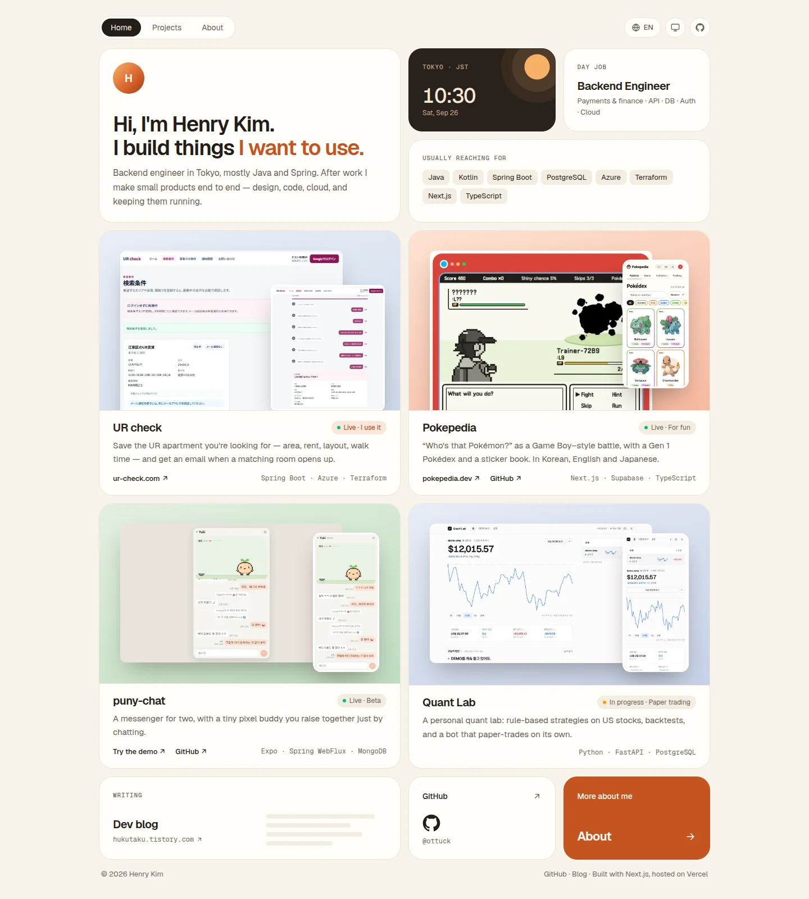

### Hi, I'm Henry Kim 👋

Backend engineer in Tokyo. At work I build payment and finance systems with Java, Kotlin and Spring. After hours I build small products of my own, and keep them running.

Before software, I spent my twenties as a hairstylist.

**Portfolio** → [portfolio-hub.dev](https://www.portfolio-hub.dev)  
**Writing** → [hukutaku.tistory.com](https://hukutaku.tistory.com/)

#### Things I've built

- **[UR check](https://ur-check.com)** — Email alerts when a UR apartment that matches your search opens up in Tokyo.  
  Spring Boot · Azure Container Apps · Terraform
- **[Pokepedia](https://pokepedia.dev)** — A Game Boy–style “Who's that Pokémon?” battle with a Gen 1 Pokédex, in Korean, English and Japanese. [Source](https://github.com/ottuck/pokepedia)  
  Next.js · Supabase · Vercel
- **[puny-chat](https://puny-chat.com/demo)** — A messenger for two, with a tiny pixel buddy you raise together just by chatting. iPhone and web. [Source](https://github.com/ottuck/buddy-chat)  
  Expo · Spring WebFlux · MongoDB Atlas · Railway · Cloudflare
- **Quant Lab** — Backtests rule-based strategies on US stocks and paper-trades them on a schedule, explaining each decision in plain words. Private, in progress.  
  Python · FastAPI · PostgreSQL · React · Docker · Tailscale

#### Usually working with

Java · Kotlin · Spring Boot · PostgreSQL · Azure · Terraform · Next.js · TypeScript

 

<a href="https://www.portfolio-hub.dev">
  <picture>
    <source media="(prefers-color-scheme: dark)" srcset="images/portfolio-dark.webp" />
    
  </picture>
</a>

<a href="https://www.portfolio-hub.dev"><b>See the projects at portfolio-hub.dev →</b></a>

